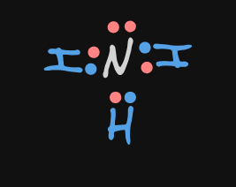

- 以 **共用價電子** 方式形成[[八隅體]]
- ## 化合物特色
	- 前提，**非** [[共價網狀物質]]
	- 低溶點、沸點（因需征服其作用力小）
- ## 鍵結
	- 稱共用價電子"對"為鍵結
	- ((661a37ab-8649-40d7-994f-60ad3d55ff18))
		- {:height 196, :width 267}
		- 綠色點點為 "價電子對"，因此 O2 為雙鍵
	- 特殊鍵結
		- ### O3
			- O(2,6) + O(2,6) + O(2,6)
			- #### Attempt 1
				- 
				- 綠 O 就會有 **10** 顆價電子
			- #### Attempt 2
				- 不行如此()，因而只能 #.kanban
					- 
					- 
				- 在任意瞬間，O3 在這兩種情況中 "震盪"，因此在 1 與 2 個鍵結中不斷切換
				- 取 "中間值" 1.5
		- BF3
- ## 基礎例子 #.kanban
	- ### NH3(單鍵)
		- N(2,5) + 3H(1)
		- {:height 197, :width 268}
	- ### O2(雙鍵)
	  id:: 661a37ab-8649-40d7-994f-60ad3d55ff18
		- O(2,6) + O(2,6)
		- {:height 196, :width 267}
		  id:: 661a3887-7e85-4aa7-bc69-7f462ace9dd5
		- 對於 **紅O** 而言，有 8 個價電子
		- 對於 **藍 O** 而言，有 8 個價電子
-
- # Draws
	- [[draws/2024-04-13-15-39-26.excalidraw]]
	- [[draws/2024-04-13-15-44-05.excalidraw]]
	- [[draws/2024-04-13-16-03-18.excalidraw]]