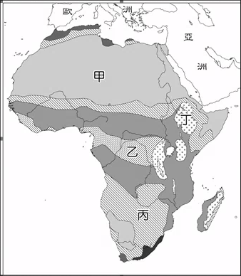

- ### 我國總統到非洲某友邦進行外交訪視，準備五頭牛做為外交賀禮。該國氣候較為炎熱乾燥，以畜牧業維生，牛隻在該國社會代表財富。請問：總統應是到附圖中何處訪視？
  
	- 答：丙
	- 誘答：甲
	- #### 解題關鍵
		- 甲：熱帶乾燥氣候
		- 乙：熱帶雨林氣候
		- 丙：熱帶莽原氣候
		- 丁：高地氣候
		- > 氣候較為炎熱乾燥，以**畜牧業**維生
			- 可知：題目問求**莽原**氣候
- ### 「這裡人煙稀少，其中一個原因是盧安瓦河一年一度的氾濫。每年10月之後的雨季期間，黑壓壓的雷雨雲開始聚積，滂沱大雨如急流般從天而降，洗去草與樹上的塵埃；暴漲的河水會重新改變土地的面貌，野生動物也隨著乾溼季節的更替而遷移。」上文所述的地區，最可能是位於下列何種氣候分區？　(A)北半球熱帶季風氣候　(B)北半球溫帶沙漠氣候　(C)南半球熱帶莽原氣候　(D)南半球地中海型氣候。
	- 答：（C）南半球熱帶莽原氣候
	- 誘答：（B）北半球溫帶沙漠氣候
	- #### 解題關鍵
		- > **10**月之後的雨季
			- 可推論可能性
			- 1. 南半球夏雨冬乾
			  2. 北半球夏乾冬雨
-