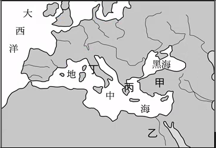
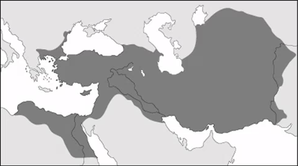

- ### 永祥在暑假參加了歐洲史蹟之旅，第一站參觀圓形競技場和萬神殿。這些建築氣勢雄偉，讓人驚訝於古人的智慧。請問：永祥的第一站來到了附圖中的何處？　(A)甲　(B)乙　(C)丙　(D)丁。
  
	- 答：丁
	- 誘答：丙
	- #+BEGIN_TIP
	  知識點：羅馬位於意大利
	  #+END_TIP
- ### 有學者認為這個文明沒有任何與《漢摩拉比法典》相應的律法，是因為這個文明的統治者就是太陽神的化身，他說的話就是法律。請問：學者說的可能是哪一個古文化？　(A)蘇美　(B)波斯　(C)埃及　(D)巴比倫。
	- 答：（C）
	- 誘答：（D）
	- #### 解題關鍵
		- > 統治者就是太陽神的化身，他說的話就是法律
		- 法老同為埃及的統治者，也是太陽神化身
		- #+BEGIN_CAUTION
		  漢摩拉比法典為太陽神**授權**給王權，王權名義上不為太陽神
		  #+END_CAUTION
- ### 附圖為某帝國的疆域圖，下列關於該帝國的敘述何者正確？
   
  (A)該國是第一個建立橫跨歐、亞、非三洲的大帝國　(B)該帝國採取地方分權的統治，中央政治力量薄弱　(C)該帝國的主要族群為兩河流域的巴比倫人　(D)該帝國主要的宗教為一神信仰的基督教。
	- 答：（A）
	- #+BEGIN_TIP
	  知識點：與亞歷山大帝國疆域最主要差異點在於是否有統治希臘
	  #+END_TIP
- ### 創造拜占庭帝國的黃金時代，並致力於統一帝國、統一教會與統一法律的大業。請問：這是何人在位時的功績？　(A)屋大維　(B)君士坦丁　(C)查士丁尼　(D)凱撒。
	- 答：（C）
	- 誘答：（D）
	- #### 解題關鍵
		- 屋大維為**結束羅馬共和**，開始羅馬和平
		- 查士丁尼為**擴張板圖** & 很多好事
- ### 古埃及文化受到尼羅河影響深遠，是「大河文化」的代表。下列何者的出現和發展，與尼羅河較無直接關係？　(A)周而復始的生命觀　(B)高度發展的農業　(C)象形文字的使用　(D)太陽曆的發明。
	- 答：（C）
	- 誘答：（A）
	- #+BEGIN_WARNING
	  周而復始的生命觀為**尼羅河***周而復始* 的氾濫
	  #+END_WARNING
- ### 羅馬帝國的國勢在三、四世紀時陷入低潮，國內秩序崩壞，外患不斷。直到某位君主擴建拜占庭為新都，並將帝國首都遷往東方，重振了羅馬帝國。請問：這位君主是誰？　(A)凱撒　(B)屋大維　(C)查士丁尼　(D)君士坦丁。
	- 答：（C）
	- 誘答：（D）
	- #### 解題關鍵
		- > 三、四世紀，擴建拜占庭
			- 可得知為羅馬和平後，拜占庭帝國創始時期
		- #+BEGIN_IMPORTANT
		  屋大維 - 結束共和，開始羅馬共和
		  君士坦丁 - 開創拜占庭帝國
		  查士丁尼 - 最偉大拜占庭帝國皇帝
		  #+END_IMPORTANT
- ### 海上貿易是今日全球化的一種體現，各國都難以置身事外。兩千年前的地中海東岸，也有一個擅長航海的民族，他們在地中海暢行無阻，建立了許多貿易據點，並將埃及人的文字簡化，傳播到地中海一帶。上述的民族應該是下列何者？　(A)埃及人　(B)腓尼基人　(C)希伯來人　(D)巴比倫人。
	- 答：（B）
	- 誘答：（C）
	- #### 解題關鍵
		- > 地中海東岸 & *貿易據點*，並將**埃及人的文字簡化**
			- 最主要為簡化埃及人文字
			- 但若無，仍可從貿易推敲
		- 希伯來人主要特徵為**猶太教**
-