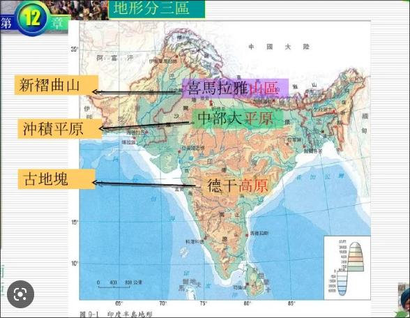

- # 歷史重要事件 #歷史
	- ## 早期台灣拓墾
		- 漢人第一次 - {{cloze 顏思齊}}
	- ## 中日戰爭
		- {{cloze 1937}} - 七七事變
		- {{cloze **1941**}} - 珍珠港事變
			- 加減 4 即可得到開始與結束
		- {{cloze 1945}} - 日本戰敗
	- ## {{cloze 1979}}
		- 中國改革開放
		- 與台灣斷交
			- 通過《 {{cloze 臺灣關係法}} 》
			- {{cloze 8}} 年前被迫推出聯合國
	- ## 台灣經濟政策
		- 出口導向
			- 為 {{cloze 輕}} 工業
				- 較 {{cloze 進口替代}} 時期高級
		- 十大建設
			- 因 {{cloze 能源}}危機
	- ## 日本抗日
		- 1930 - 霧社事件
		- 1915 - 西來庵
	- ## 分裂的朝代
		- 犬戎之禍 - {{cloze 周}}朝
		- 永嘉之禍 - {{cloze 晉}}朝
		- 靖康之禍 - {{cloze 宋}}朝
	- ## 戰爭與條約
		- 南京條約( {{cloze 1840}} )
			- 割讓香港
				- 1997 年回歸（澳門 {{cloze 2}} 年後)
			- 協定關稅
				- 於 {{cloze 十大建設}}時期收回
			- 五口通商
		- 英法聯軍
			- 南京條約 {{cloze 20}} 年後
			- 第一次 - {{cloze 天津條約}}
				- 開港 {{cloze 內陸}} & {{cloze 台灣}}
			- 第二次 - {{cloze 北京條約}}
				- 開港 {{cloze 天津}}
		- 甲午戰爭
			- 因 {{cloze 朝鮮問題}}
- # 地理重要觀念 #地理
	- 台灣生物多樣性原因
		- {{cloze 北迴歸線通過}}
		- 孤立島嶼為形成 {{cloze 特有種}} 的原因
	- 台灣四極
		- 北 - {{cloze 富貴角}}
		- 南 - {{cloze 鵝鑾鼻}}
		- 西 - {{cloze 尖仔尾}}（不常考）
		- 東 - {{cloze 三貂角}}（不常考）
	- 高壓導致 - {{cloze 天氣晴朗}}，但是晚上 {{cloze 較冷}}
	- 中國比例最高兩大地形
		- 1. {{cloze 山地}} (33%)
		- 2. {{cloze 高原}} (26%)
	- 郊區化現象 - {{cloze 都市人口向外遷移}}
	- ## 中國各類分界線
		- 黑河 -- 橫衝
			- {{cloze 農業 -- 畜牧}}
			- {{cloze 稠密 -- 稀疏}}
			- 季風 -- 非季風
		- 秦嶺、淮河
			- 以北 - 溫帶
			- 以南 - 副熱帶
	- ## 東南亞相對位置
		- 中南半島（從東到西）
			- {{cloze 越南}}
			- {{cloze 柬埔寨}} / {{cloze 寮國}}
			- {{cloze 泰國}}
			- {{cloze 緬甸}}
	- ## 南亞宗教
		- 不丹 - {{cloze 印度教}}
		- 尼泊爾 - {{cloze 佛教}}
		- 孟加拉 - {{cloze 伊斯蘭教}}
		- 圖（綠為伊斯蘭）
			- 
	- ## 南亞三季
		- 6 ~ 10 雨季（夏天）
		- 11 ~ 2 涼季
			- 因 {{cloze 季風轉換期}}
		- 3 ~ 5 熱季
	- ## 南亞地形
		- 中南部 {{cloze 德干高原}}
			- 被東西 {{cloze 高止}}山所包圍
		- 中部 - {{cloze 中部大平原}}
		- 北部 - {{cloze 喜馬拉雅山脈}}
		- 西北部 - {{cloze 塔爾沙漠}}
		- 圖
			- 
		-
	- ## 日本洋流
		- 寒暖流交匯
			- 寒 - {{cloze  黑潮}}
			- 暖 - {{cloze 親潮}} & {{cloze 庫葉}}
		- {{cloze 西}} 岸降水較多
			- 因 {{cloze 西北}}季風
	- ## 太平洋三大島群
		- 皆位於台灣 {{cloze 南方}}
	- ## 澳洲地形與氣候
		- 西部 - {{cloze 高原}}
		- 中部 - {{cloze 平原}}
		- 大分水嶺以東 - {{cloze 沿海平原}}
		- 
- # 公民重要概念 #公民
  collapsed:: true
	- ## 保護處分
		- 訓誡
			- {{cloze 法官}} - 悔過書
		- 生活輔導
			- {{cloze 少年保護官}} - 假日時施予品德教育
		- 保護管束
			- {{cloze 少年保護官}} - 與少年保持接觸
		- 安置輔導
			- 當少年不宜由 {{cloze 法定代理人教養}}時，交由適當的福利加以輔導
- # 生物概念 #生物
	- ## 水分的運輸及蒸散作用
		- 影響因素
			- 構造：
				- ### 氣孔
					- 在 {{cloze 白天}}(白天/晚上)、 {{cloze 水分}}充足，氣孔開啟
					- 吸水 {{cloze 膨脹}}，失水 {{cloze 萎縮}}
			- 環境：
				- 溫度、 {{cloze 風速}}、光照 、空氣與土壤的含水量
		- 水上升原因 {{cloze 蒸散作用}}
	- ## 植物的演變
		- ### 藻類（非植物，為 {{cloze 原生生物}}界）
			- 無 {{cloze 角質層}}
				- 必須在水邊
			- 以 {{cloze 孢子}}繁殖
		- ### 蘚苔植物
			- 較藻類多了 {{cloze 角質層}}
			- 無 {{cloze 維管束}}
				- 導致個體 {{cloze 矮小}}
			- 以 {{cloze 孢子}}繁殖
		- ### 蕨類植物
			- 較蘚苔多了 {{cloze 維管束}}
			- 以 {{cloze 孢子}}繁殖
			- 例：筆筒樹
		- ### 種子植物
			- 較蕨類多：
				- {{cloze 花粉}}
				- {{cloze 花粉管}}
					- 導致生殖不需 {{cloze 水}} 當媒介
				- {{cloze 胚珠}}
			- #### 裸子植物
				- 以 {{cloze 種子}} 繁殖
					- 生殖器官 {{cloze 毬果}}
					- 以 {{cloze 風力}} 傳播
			- #### 被子植物
				- 以 {{cloze 種子}} 繁殖
					- 藉由 {{cloze 昆蟲}} 或 {{cloze 風}} 傳播
					- 生殖器官 {{cloze 果實(子房)}}
	- ## 動物
		- 數量最多的門 - {{cloze 節肢動物門}}
		- 具有管足的門 - {{cloze 棘皮}}
		- ### 軟體與環節比較
			- 軟體 {{cloze 不分}}節，通常具有殼
				- 例：
					- 蝸牛
					- 蛤蜊
					- 烏賊
					- 章魚
			- 環節通常與蚯蚓形似
		- ### 扁形動物門
			- {{cloze 再生 }}能力強
				- {{cloze 渦蟲}}
		- ### 棘皮動物門
			- 海 {{cloze 參、星、膽}}（有三個）
		- ### 刺細胞動物門
			- 珊瑚
			- 淡水動物： {{cloze 水螅}}
		- ### 脊索動物門
			- 分類方法，具有 {{cloze 脊椎骨}}
			-
		-