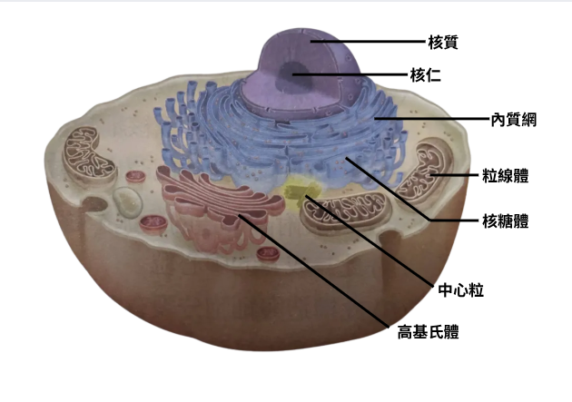

id:: 68676cb0-8294-4104-b83e-39ae9317ebe5
deck:: 生物::細胞構造

- {{c2 平滑::平滑/粗糙}}內質網 <-> {{c1 運輸蛋白質}}
  id:: 68676ce6-a87a-4932-8187-8b2d712e636c
- {{c2 粗糙::平滑/粗糙}}內質網 <-> {{c1 合成脂質}}
  id:: 68676dbe-5359-429c-a1f0-0f46d8649469
- 溶體功能 :-> 細胞的垃圾桶
  id:: 686bc0a5-ba9d-4168-ac27-f8fd88a03724
- 核糖體由 {{c1 核仁}}  合成
  extra:: (若回答細胞核則不夠準確)
  id:: 68693895-d67c-4295-be23-c313a6cee06b
- 高基氏體功能 #card #incremental
  id:: 68693259-ff13-459e-a803-b105c892648b
	- 加工、包裝、分類蛋白質
	- 形成溶體(利用囊泡)
- {:height 451, :width 630}
  occlusion:: eyIuLi9hc3NldHMvaW1hZ2VfMTc1MTcyNTEwMTAzMl8wLnBuZyI6eyJjb25maWciOnt9LCJlbGVtZW50cyI6W3sibGVmdCI6NDg5LjE2NjY4NzAxMTcxODc1LCJ0b3AiOjQ2Ljg0MTc3MzUzMTAwMDQ1Niwid2lkdGgiOjM0LjMzMzM3NDAyMzQzNzUsImhlaWdodCI6MTkuMjM0NzMzMDQ4OTkwNjIzLCJhbmdsZSI6MCwiY0lkIjoxfSx7ImxlZnQiOjQ2OC4xNjY2ODcwMTE3MTg3NSwidG9wIjo4Mi44NDEzMDIzMjg1MzI0LCJ3aWR0aCI6MzQuMzMzMzc0MDIzNDM3NSwiaGVpZ2h0IjoyMy4yMzI5ODk1OTk4NTg3OCwiYW5nbGUiOjAsImNJZCI6Mn0seyJsZWZ0Ijo1NjQuNjY2Njg3MDExNzE4OCwidG9wIjoxMzEuNzI1NTIwMjIyMzM1OTQsIndpZHRoIjo1MS4zMzMzNzQwMjM0Mzc1MSwiaGVpZ2h0IjoyMS4wMDAyNDczODEyOTU3MSwiYW5nbGUiOjAsImNJZCI6M30seyJsZWZ0Ijo1NTYuNjY2Njg3MDExNzE4OCwidG9wIjoxOTIuODQyMjM4ODQzNDM3Nywid2lkdGgiOjQ5LjMzMzM3NDAyMzQzNzUsImhlaWdodCI6MjMuMjMyMjcxMDE2MDk1MDk4LCJhbmdsZSI6MCwiY0lkIjo0fSx7ImxlZnQiOjU1OC4xNjY2ODcwMTE3MTg4LCJ0b3AiOjI0Mi43MjY4Mjc4MDkxODQ4LCJ3aWR0aCI6NTQuMzMzMzc0MDIzNDM3NSwiaGVpZ2h0IjoyNy4wMDAzMTgwNjE2NjU5MjIsImFuZ2xlIjowLCJjSWQiOjV9LHsibGVmdCI6NTA3LjE2NjY4NzAxMTcxODc1LCJ0b3AiOjMxOS44NDUxMDcyODg0NjIsIndpZHRoIjo1MC4zMzMzNzQwMjM0Mzc1LCJoZWlnaHQiOjI3LjIzNTA2Mjg5MDcxODMyNSwiYW5nbGUiOjAsImNJZCI6Nn0seyJsZWZ0Ijo0NzMuNjY2Njg3MDExNzE4NzUsInRvcCI6MzY0LjIyODI1OTA4NjY4MTUzLCJ3aWR0aCI6NzUuMzMzMzc0MDIzNDM3NSwiaGVpZ2h0IjoyNC4wMDAyODI3MjE0ODA4LCJhbmdsZSI6MCwiY0lkIjo3fV19fQ==
  id:: 68693261-3de4-4a2c-af4e-b1e0ae39ac3a
- # 模種分類
	- 內質網 -> {{c1 單層模::[單/雙/無]層模}}
	  id:: 68693702-e580-462e-b305-280c21a73199
	- 高基氏體  -> {{c1 單層模::[單/雙/無]層模}}
	  id:: 09d951a5-586f-4b05-b5e0-aea94fa68f34
	- 溶體  -> {{c1 單層模::[單/雙/無]層模}}
	  id:: 997f98f0-7db9-4762-a1f3-a49a3cb3c556
	- 液泡 -> {{c1 單層模::[單/雙/無]層模}}
	  id:: 66f7e9d3-5b6c-4558-9198-18997df6058c
	- 細胞膜(磷脂質)  -> {{c1 雙層模::[單/雙/無]層模}}
	  id:: 82566953-11d7-4761-b702-8bed14bd9cad
	- 核膜(磷脂質) -> {{c1 雙層模::[單/雙/無]層模}}
	  id:: 34563d3d-3dbd-4766-846f-9b2205391d8e
	- 粒線體 -> {{c1 雙層模::[單/雙/無]層模}}
	  id:: c738ce02-d9df-4f83-9eb3-56a803994d74
	- 葉綠體 -> {{c1 雙層模::[單/雙/無]層模}}
	  id:: a1ab900a-68a5-47fc-9299-92643ea8567f
	- 中心粒 -> {{c1 無模::[單/雙/無]層模}}
	  id:: 68693993-ff9a-424d-8488-8c77ea799029
	- 核糖體 -> {{c1 無模::[單/雙/無]層模}}
	  id:: 686939a3-d2aa-4d7b-8b78-68a5b41e1c85
-