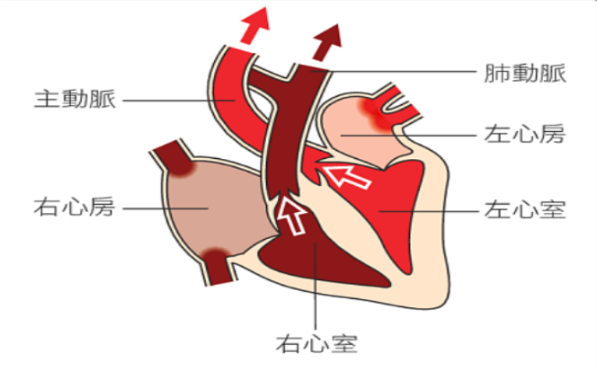

deck:: 自然一上::第三課-動物體內物質的運輸

- 動物體內物質的運輸，依賴循環系統
- # 循環系統的分類
	- ## 開放式循環
		- {{cloze 血液由血管內流入體腔，與組織細胞交換物質後，流回血管、心臟::定義}}
		- ### 例 #card
			- 蝦
			- 蝸牛
			- 昆蟲
	- ## 閉鎖式循環
		- {{cloze 血液只在心臟和血管中流動，不可流到體腔::定義}}
		- 藉微血管與 {{cloze 組織細胞}}交換物質
		- ### 例 #card
			- 蚯蚓
			- 魚
			- 蛙
			- 人類
	- ## 人類循環系統分類
		- 血液循環系統 #card
			- 心臟
			- 血管
			- 血液
		- 淋巴循環系統
- # 血液循環系統
	- ## 心臟
		- ### 位置 #card
			- 位於胸中央偏左
			- 上方為左心房和右心房
				- 實際位置左右相反
			- 下方為左心室和右心室
				- 實際位置左右相反
			- 心室 > 心房
		- ### 心搏
			- 心臟收縮與舒張
			- 為血液在血管中流動的主要動力來源
			- 收縮 -> {{cloze 因擠壓而流入動脈}}
				- {:height 215, :width 345}
			- 舒張 ->  {{cloze 靜脈的血液流回心臟}}
				- {:height 218, :width 339}
	- ## 血管
		- ### 動脈 #card
			- 將血液自心臟送到身體各組織
			- 管壁厚，富彈性
		- ### 微血管 #card
			- 管壁只有一層細胞的厚度
				- 為讓血液和組織細胞間進行物質交換
		- ### 靜脈
			- 管壁比動脈薄，彈性較低
				- 但管腔則比動脈大
			- 有些靜脈具瓣膜
				- 為防止血液逆流
		- ### 比較
			- ||動脈|微血管|靜脈|
			  |管壁|最厚|最薄|次之|
			  |管腔|次之|最薄|最大|
			  |血壓|最高|最低|次之|
			  |流速|最快|最慢|次之|
	- ## 血液
		- ### 血漿 #card
			- 主要成分為水
			- 內也有養分、激素、代謝產生的廢物等物質
		- ### 血球
			- #### 紅血球 #card
				- 不具細胞核
				- 呈雙凹圓盤
				- 數量最多
				- 主要功能為攜帶氧氣
					- 血紅素
			- #### 白血球 #card
				- 具有細胞核
				- 數量最少
				- 主要功能為如吞噬痛原體
					- 若有病原體侵，數目會急遽增加
			- ### 血小板 #card
				- 不具細胞核，形狀不規則
				- 體積最小
				- 主要功能為促使血液凝固
			- #### 比較
				- ||紅血球|白血球|血小板|
				  |數量|最多|最少|次之|
				  |細胞核|無|有|無|
				  |形狀|雙凹圓盤狀|圓球形|不規則|
				  |大小|次之|最大|最小|
				  |功能|攜帶氧氣|吞噬病原體|促使血液凝固|