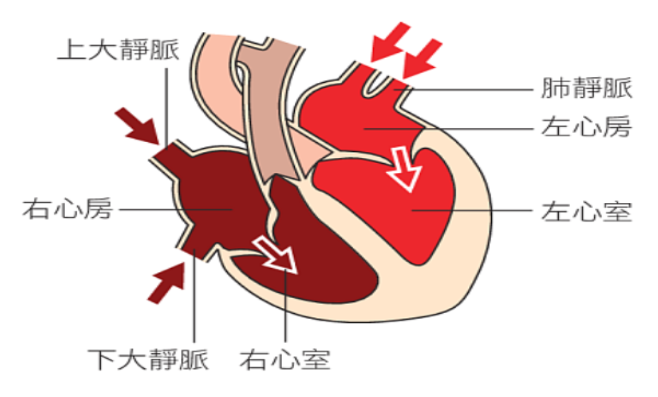

deck:: 自然一上::第三課-動物體內物質的運輸

- 動物體內物質的運輸，依賴循環系統
- # 循環系統的分類
  collapsed:: true
	- ## 開放式循環
		- 血液由血管內流入體腔，與組織細胞交換物質後，流回血管、心臟
		- ### 例
			- 蝦
			- 蝸牛
			- 昆蟲
	- ## 閉鎖式循環
		- 血液只在心臟和血管中流動，不可流到體腔
		- 藉微血管與組織細胞交換物質
		- ### 例
			- 蚯蚓
			- 魚
			- 蛙
			- 人類
	- ## 人類循環系統分類
		- 血液循環系統
			- 心臟
			- 血管
			- 血液
		- 淋巴循環系統
- # 血液循環系統
	- ## 心臟
		- ### 位置
			- 位於胸中央偏左
			- 上方為左心房和右心房
				- 實際位置左右相反
			- 下方為左心室和右心室
				- 實際位置左右相反
			- 心室 > 心房
		- ### 心搏
			- 心臟收縮與舒張
			- 為血液在血管中流動的主要動力來源
			- 收縮 -> 因擠壓而流入動脈
				- {:height 215, :width 345}
			- 舒張 -> 靜脈的血液流回心臟
				- {:height 218, :width 339}
	- ## 血管
		- ### 動脈
			- 管
		- ### 微血管
		- ### 靜脈